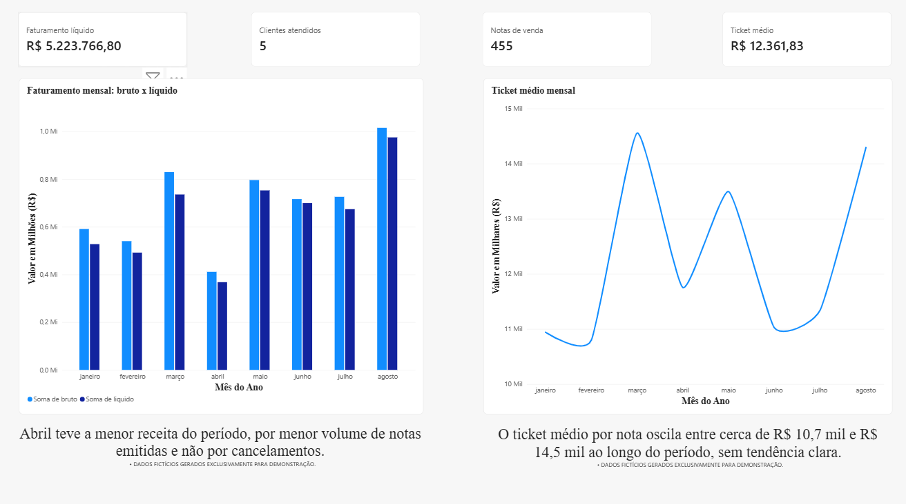

# Análise de vendas a partir de exportações do ERP

Neste projeto, transformo a exportação de vendas de um ERP em um relatório simples de faturamento, clientes, produtos e vendedores. O caminho vai do CSV bruto até um dashboard no Power BI, passando por limpeza em Python, armazenamento em SQLite e análise em SQL.

> **Sobre os dados:** todos os dados deste repositório são **sintéticos**. Eles foram gerados por `src/make_synthetic.py`, que reproduz a estrutura do arquivo exportado do ERP, e não contêm nenhuma informação real de empresa, clientes ou colaboradores. Alguns padrões (queda de faturamento em um mês, concentração em um cliente, cancelamentos, uma anomalia de escala) foram inseridos de propósito, para que eu pudesse conferir se as consultas os encontravam.



## Contexto

O ERP exporta um CSV com uma linha por item de nota fiscal. Os valores chegam como texto, as datas seguem o formato brasileiro e os cancelamentos aparecem como notas separadas, com quantidades e totais negativos. Diante disso, qualquer soma direta sobre o arquivo bruto produz um número errado, e a empresa ainda não tinha uma visão consolidada de quem compra, o que mais vende e como cada vendedor contribui.

Resolvi documentar o processo para mostrar como trabalho no dia a dia: do dado sujo até uma entrega que o gestor consiga ler sem precisar abrir a planilha.

## Fluxo dos dados

```
CSV do ERP  →  limpeza (pandas)  →  SQLite  →  consultas SQL  →  Excel  →  Power BI
(bruto, nunca alterado)            (vendas.db)   (queries.py)    (export)   (dashboard)
```

O arquivo bruto nunca é modificado. A limpeza gera uma versão tratada, que é carregada no banco, e todas as análises partem dele. Dessa forma, se uma regra mudar, basta rodar o processo de novo.

## Desafios do dado e como resolvi

- **Tudo como texto.** Leio o CSV com `dtype=str` e converto cada coluna de forma explícita, em vez de deixar o pandas adivinhar.
- **Números no padrão brasileiro.** Quantidades com ponto de milhar e valores com vírgula decimal precisam de tratamento antes de virarem número.
- **Cancelamentos como notas separadas.** Cada cancelamento tem a sua própria nota, com quantidade e total negativos. Por isso o faturamento líquido é a soma das vendas com essas linhas negativas.
- **Descrições fora do padrão.** Itens cuja descrição não segue o formato esperado são descartados na limpeza. No arquivo sintético, isso reduz 1013 linhas para 1001.
- **Anomalia de escala.** Em uma das notas, a quantidade vem dividida por um milhão e o valor unitário multiplicado pelo mesmo fator. O total continua correto, mas as unidades ficam subestimadas, e por isso evito usar unidades onde essa nota pesa.

## Decisões de análise

Para medir desempenho, uso a coluna `Total`, que não inclui impostos. O faturamento líquido é o faturamento das notas de venda menos os cancelamentos, em valor sem impostos, e o ticket médio é o faturamento bruto dividido pelo número de notas de venda. Optei por não contar as notas de cancelamento nessa divisão, porque uma nota de cancelamento desfaz uma venda e não representa uma venda nova. Essa escolha tem uma limitação, que descrevo mais abaixo.

## Validação com dados sintéticos

Antes de confiar em qualquer consulta, planto um padrão conhecido nos dados sintéticos e verifico se a consulta o encontra. É o caso da queda de faturamento em abril, da concentração das vendas em um cliente e dos cancelamentos com reemissão. Quando o resultado bate com o que foi plantado, aplico a mesma consulta ao dado real, com mais segurança de que ela está correta.

## O que o dashboard mostra

O relatório tem quatro páginas: visão geral, clientes, produtos e vendedores.

Na visão geral, o faturamento líquido do período foi de R$ 5.223.766,80, em 455 notas de venda, com ticket médio de R$ 12.361,83. O gráfico mensal mostra que abril teve o menor faturamento do período, por menor volume de notas emitidas e não por cancelamentos, o que diferencia uma queda de demanda de um problema de cancelamento.

Na página de clientes, a COMERCIAL ALFA concentra a maior fatia, com cerca de 37,6% do faturamento líquido, seguida pela ATACADO OMEGA (~21,7%) e pela DISTRIBUIDORA BETA (~17,5%). Diante disso, a receita depende de poucos clientes, o que é um ponto de atenção para a operação.

Na página de produtos, o FRASCO 500ML lidera com cerca de 65% do faturamento, seguido pela DOSADORA R2 28/43, com cerca de 20%. Como o catálogo sintético tem apenas quatro produtos, a concentração aparece de forma mais acentuada do que em uma operação real.

Na página de vendedores, a participação de cada um reflete o tamanho da sua carteira (um vendedor atende apenas um cliente, por exemplo), e por isso a comparação não mede desempenho individual.

## Como executar

```
python -m venv venv
venv\Scripts\activate
pip install -r requirements.txt
python src/make_synthetic.py
python src/load_db.py data/synthetic/vendas_sintetico.csv vendas_sintetico.db
python src/queries.py vendas_sintetico.db
python src/export_relatorio.py vendas_sintetico.db relatorio/relatorio_sintetico.xlsx
pytest
```

O Excel gerado é a fonte de dados do dashboard no Power BI. O arquivo `.pbix` não está no repositório.

## Estrutura

```
data/synthetic/   CSV sintético
src/              limpeza, carga, consultas e exportação
tests/            testes com pytest
docs/images/      imagens do dashboard
```

## Testes

Os testes com pytest cobrem a etapa de limpeza, que é onde um erro se propaga para todas as análises seguintes. Pretendo incluir testes para o gerador de dados sintéticos.

## Limitações

O ticket médio usa o faturamento bruto e ignora os cancelamentos. Uma versão ajustada pelas vendas que de fato permaneceram exigiria associar cada cancelamento à venda original, o que nem sempre é possível, principalmente quando há reemissões. Essa análise fica para uma segunda etapa.

## Stack

Python (pandas, openpyxl), SQLite, SQL (CTEs, subconsultas e funções de janela), Power BI, pytest e Git.

## Próximos passos

Análise de cancelamentos e reemissões, automação da atualização dos dados e conteinerização do projeto.

## Contato

Se você trabalha com dados e quiser trocar figurinhas sobre o projeto, é só chamar na DM do LinkedIn.